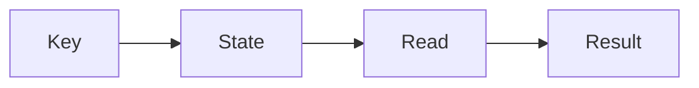

# ChronoGit documentation site

This directory contains the Astro Starlight site for ChronoGit's English and Japanese user and developer documentation. It includes locale-specific tag search, compact page metadata, KaTeX equations, themed Mermaid diagrams, and responsive desktop and mobile navigation.

The private package exists only to build the site locally and is not published to npm. The generated `dist/` directory may later be deployed to GitHub Pages or Azure after the canonical site URL and hosting target are selected.

## Work locally

Requirements:

- a Node.js release supported by the locked Astro version;
- [pnpm](https://pnpm.io/).

Install dependencies and start the background development server:

```sh
pnpm install --frozen-lockfile
pnpm dev
```

| Command | Purpose |
| --- | --- |
| `pnpm dev` | Start the Astro server in background mode |
| `pnpm dev:status` | Show the background server status |
| `pnpm dev:logs` | Read server logs |
| `pnpm dev:stop` | Stop the background server |
| `pnpm build` | Build all pages and Pagefind indexes into `dist/` |
| `pnpm preview` | Preview an existing production build |

## Content layout

English is the root locale. Japanese pages use `/ja/` and mirror the same relative paths:

```text
src/content/docs/
├── index.mdx
├── guides/                 # Installation and user workflows
├── reference/              # CLI, safety, limits, and non-goals
├── troubleshooting/        # Failure diagnosis and recovery
├── developer/              # Architecture, terminal smoke, and release
├── tags.mdx
└── ja/
    ├── index.mdx
    ├── guides/
    ├── reference/
    ├── troubleshooting/
    ├── developer/
    └── tags.mdx
```

When changing behavior, update both language versions in the same change. Keep their file paths and `sidebar.order` values aligned so Starlight can connect translations and present matching navigation.

Every content page has a search description and locale-specific tags. The `/tags/` and `/ja/tags/` explorers intentionally keep the two languages separate. `publishedAt`, `updatedAt`, and `tags` are optional schema fields; regular pages show the description and available metadata below the title, while splash pages omit that row. Use ISO dates and keep tag spellings consistent within each language.

Use `.md` for ordinary pages and `.mdx` only when an Astro or Starlight component materially improves the page. Mermaid fences render with the site palette and follow light/dark theme changes. Include `accTitle` and `accDescr` in each diagram so its meaning is available to assistive technology:

````md

````

Inline math uses single dollar signs and display math uses double dollar signs. Both Markdown and MDX pages render it with KaTeX during the build. Escape a literal dollar sign as `\$` when it could be parsed as math.

## Site configuration

`astro.config.mjs` owns the ChronoGit title, locales, sidebar groups, H2–H4 table of contents, Markdown processing, code theme, and optional publication metadata. `src/content.config.ts` extends Starlight frontmatter with dates and locale-scoped tags.

The repository and site origins are intentionally unset because their canonical public URLs have not been selected. Supply `PUBLIC_REPOSITORY_URL` to enable the GitHub and edit-page links. Supply `PUBLIC_SITE_URL` before publishing so canonical metadata and sitemap URLs are correct. Do not insert a placeholder or assume a hosting provider.

Theme tokens live in `src/styles/theme.css`; typography, content surfaces, responsive layout, and landing-page rules live in `src/styles/site.css`. The custom components provide page metadata, shared desktop/mobile navigation, Mermaid theme synchronization, and the locale-scoped tag explorer. On mobile, Docs and Tags move into the navigation menu; pages without a sidebar use the same compact menu for those links plus the theme and language controls.

## Validate

Run the production build after every content, configuration, component, or styling change:

```sh
pnpm build
```

Confirm that every English route has its Japanese counterpart, internal links resolve, Pagefind indexes both locales, Mermaid diagrams have accessible labels, and no starter names or placeholder URLs remain. Styling changes also need desktop/mobile and light/dark inspection with keyboard focus.

The project is licensed under either Apache-2.0 or MIT; see `../LICENSE-APACHE` and `../LICENSE-MIT`.
