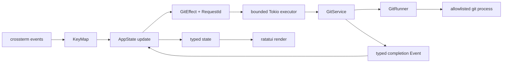

ChronoGit is a single Rust binary split into domain, Git adapter, application state, and terminal presentation layers. These boundaries keep Git and terminal I/O out of domain rules and make state transitions testable without a real terminal.

The shorter module map is in the repository's `DEVELOPMENT.md`. This page records the deeper constraints to preserve when changing those modules.

## Module ownership

### `src/domain`

Owns repository paths, object IDs, changes, commits, diffs, and tree entries. It has no subprocess or terminal dependency.

- `RepositoryRoot`, `RepoPath`, `ObjectId`, and `RequestId` prevent values with different meanings from being mixed.
- `CommitBaseline` makes empty-tree and first-parent comparisons explicit.
- `DiffTarget` identifies either an index-to-worktree path or a commit/baseline/path triple.
- `DiffDocument` represents text, binary, empty, and truncated results as exclusive variants.
- Git paths remain bytes internally on Unix; only presentation is lossy for a non-UTF-8 name.

Fields stay private. Constructors enforce absolute repository roots, relative repository paths, no NUL path bytes, and hexadecimal object IDs.

### `src/git`

Owns all communication with the installed Git executable.

- `GitCommand` is a closed allowlist; callers cannot pass arbitrary arguments.
- `GitRunner` is the only substitution trait because subprocess I/O is a real slow and stateful test boundary.
- `SystemGitRunner` executes without a shell, captures bounded byte output, and disables optional locks, prompts, pager, color, external diff, textconv, and fsmonitor execution.
- `GitService` exposes domain use cases: discovery, status, history, message, changed files, diff, and tree children.
- `git::parse` modules decode NUL-delimited machine output and unified patches.

The repository object format is not assumed to be SHA-1. ChronoGit retains complete hexadecimal IDs returned by Git.

### `src/app`

Owns interactive state and transitions.

- `AppView`, `FocusedPane`, `HistoryPanel`, and `Overlay` model mutually exclusive UI states. The body-oriented History layout is a first-class view, while the complete commit message remains an overlay.
- `SearchState` owns prompt editing, query direction, ordered matches, and wraparound selection independently of the searched collection, so later list/file search can reuse the same behavior.
- `LoadState<T>` is idle, loading with a request ID, ready, or failed.
- `Action` represents user intent, `Event` an asynchronous completion, and `GitEffect` the only Git side-effect description.
- Every request receives a monotonically increasing `RequestId`. A completion applies only if it still matches the current resource and selected commit.
- Diff requests have a 75 ms debounce and at most two Git tasks run concurrently.
- The diff cache keeps at most 16 entries and 16 MiB. Refresh clears it.
- History loads 200 commits per page. Messages, changed files, diffs, and tree directories load on demand.

Tree directories are expanded by object ID. Loaded children are cached for the selected commit; the flattened visible tree stores complete repository paths and depth.

### `src/tui`

Owns key translation, terminal lifecycle, layout, rendering, and the event loop.

- `KeyMapper` converts Vim-oriented key events to actions. `h`/`l` and `Ctrl-k`/`Ctrl-j` share the previous/next-pane actions. The `zh`/`zl` sequence expires after 750 ms.
- `TerminalSession` enables raw mode and the alternate screen and restores terminal state from `Drop`.
- A panic hook performs the same restoration before forwarding to the previous hook.
- `tokio::select!` waits for terminal input, resize/tick events, Ctrl-C, and Git completion events.
- Standard History renders commits, changed files/tree, and diff as three full-width rows. Its body layout renders the same commit list, commit body, and changed files; changing the top-row selection reloads the other rows. Changes renders both panes from 110 columns and gives the focused pane the full width below that threshold.
- Below 80×24, rendering becomes a stable size message and quit remains available.

## Git comparison contracts

| Target | Comparison |
| --- | --- |
| Tracked worktree file | Index → working tree |
| Untracked file | `/dev/null` → working-tree file |
| Root commit | Empty tree → commit |
| Normal commit | Parent → commit |
| Merge commit | First parent → merge commit |

`status --porcelain=v2 -z` provides worktree state. Inclusion follows the worktree side of XY, so staged-only entries are excluded. Changed-file and tree parsers consume NUL-delimited output. Object metadata uses fixed field counts rather than screen-oriented columns.

## Error and shutdown policy

`AppError` and `GitError` implement `Display`, `Error`, and source chaining without `anyhow` or `thiserror`. Startup errors leave the terminal untouched. Recoverable runtime failures become `LoadState::Failed` or a visible notice.

Git stdout is limited to 8 MiB, stderr to 64 KiB, and command duration to 30 seconds. Crossing a limit kills the child. A partial text patch becomes `DiffDocument::Truncated`; partial machine-readable responses fail instead of being parsed.

No new effects are dispatched during exit. Dropping the Tokio runtime completes already-running blocking tasks, and the terminal guard restores the terminal as the TUI returns.

## Security and compatibility invariants

- Do not add a Git mutation command to `GitCommand`.
- Keep repository paths and pathspecs as separate process arguments, never shell text.
- Reuse object IDs as revisions only after hexadecimal validation.
- Prevent repository configuration from launching pager, diff, textconv, or fsmonitor programs.
- Preserve integration tests that compare `HEAD`, porcelain status, and worktree bytes before and after every read operation.
- Linux and macOS are the `0.1.0` support boundary. A Windows port must redesign the Unix byte-path boundary rather than adding unchecked conversion.
- Reject bare repositories and non-interactive terminals during startup.

Future features should add a domain variant and a typed command/effect path instead of bypassing these boundaries.

## Where to make a change

| Change | Primary location | Also inspect |
| --- | --- | --- |
| Domain invariant or value type | `src/domain` | Parsers, app state, integration fixtures |
| Git operation | `src/git/command.rs`, `runner.rs`, `service.rs` | Read-only policy, output bounds, parser tests |
| Async loading or selection | `src/app/model.rs`, `update.rs`, `effect.rs` | Request IDs, stale responses, cache bounds |
| Key or interaction | `src/tui/keymap.rs` | Reducer behavior, help/footer text, docs |
| Layout or terminal lifecycle | `src/tui/render`, `terminal.rs`, `tui/mod.rs` | Minimum sizes, PTY smoke checks, restoration |

Read the implementation and the nearest tests before changing any invariant. The [validation guide](/developer/validation/) explains the required verification layers.
