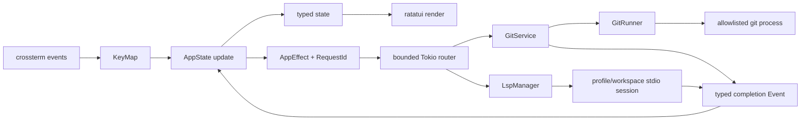

ChronoGit is a single Rust binary split into domain, Git adapter, application state, and terminal presentation layers. These boundaries keep Git and terminal I/O out of domain rules and make state transitions testable without a real terminal.

The shorter module map is in the repository's `DEVELOPMENT.md`. This page records the deeper constraints to preserve when changing those modules.

Each layered module uses Rust's non-`mod.rs` layout: `src/<module>.rs` documents
and declares the boundary, while `src/<module>/*.rs` owns its cohesive child
concepts. Preserve this layout when adding or splitting modules.

## Module ownership

### `src/domain.rs` and `src/domain/`

Owns repository paths, object IDs, changes, commits, diffs, tree entries, search hits, and bounded current-file documents. It has no subprocess or terminal dependency.

- `RepositoryRoot`, `RepoPath`, `ObjectId`, and `RequestId` prevent values with different meanings from being mixed.
- `CommitBaseline` makes empty-tree and first-parent comparisons explicit.
- `DiffTarget` identifies either an index-to-worktree path or a commit/baseline/path triple.
- `DiffDocument` represents text, binary, empty, and truncated results as exclusive variants.
- Git paths remain bytes internally on Unix; only presentation is lossy for a non-UTF-8 name.

Fields stay private. Constructors enforce absolute repository roots, relative repository paths, no NUL path bytes, and hexadecimal object IDs.

### `src/git.rs` and `src/git/`

Owns all communication with the installed Git executable.

- `GitCommand` is a closed allowlist; callers cannot pass arbitrary arguments.
- `GitRunner` is the only substitution trait because subprocess I/O is a real slow and stateful test boundary.
- `SystemGitRunner` executes without a shell, captures bounded byte output, and disables optional locks, prompts, pager, color, external diff, textconv, and fsmonitor execution.
- `GitService` exposes domain use cases: discovery, status, history, message, changed files, diff, tree children, tracked/non-ignored path listing, file/content search, per-file history, and bounded current-file content. Current-file opens stay relative to the discovered worktree descriptor and reject symbolic links in every path component.
- `git::parse` modules decode NUL-delimited machine output and unified patches.

The repository object format is not assumed to be SHA-1. ChronoGit retains complete hexadecimal IDs returned by Git.

### `src/app.rs` and `src/app/`

Owns interactive state and transitions.

- `AppView`, `FocusedPane`, `HistoryPanel`, and `Overlay` model mutually exclusive UI states. Changes, History/body, Graph/details, file history, and Code are views; repository search, complete messages, full diffs, current file content, and full Code content are overlays.
- `SearchState` owns search inside a loaded diff or full Code file. `RepositorySearchState` separately owns the global prompt, live query, results, selection, and return view. An active prompt represents Search focus; moving to Results retains the query so returning to Search can restore and edit it. Every query edit issues a new typed effect; request IDs prevent an older completion from replacing newer results. `FileViewState` owns the selected search-result path, its history/current content, and whether the lower pane shows content or a historical diff. `CodeViewState` owns the complete path set, projected visible tree, selected path, bounded content, and code viewport.
- `LoadState<T>` is idle, loading with a request ID, ready, or failed.
- `Action` represents user intent, `Event` an asynchronous completion, and `GitEffect` a closed Git side-effect description.
- `AppEffect` routes existing `GitEffect` values and persistent `LspEffect` values without mixing their lifecycle policies. `SemanticNavigationState` owns candidates, request identity, and a bounded bidirectional jump history; `LspHoverState` owns the hover request, return overlay, and scroll offset.
- Every request receives a monotonically increasing `RequestId`. A completion applies only if it still matches the current resource and selected commit.
- Diff requests have a 75 ms debounce, live repository searches have a 100 ms debounce, and at most two Git tasks run concurrently.
- The diff cache keeps at most 16 entries and 16 MiB. Refresh clears it.
- History loads 200 commits per page and file history loads up to 200 commits. Messages, changed files, diffs, current content, searches, and tree directories load on demand.

Tree directories are expanded by object ID. Loaded children are cached for the selected commit; the flattened visible tree stores complete repository paths and depth.

The Code tree is different: Git enumerates all tracked and non-ignored worktree paths once, and `app::code_view` projects only the direct children of each expanded directory into a flattened visible list. No additional filesystem traversal or subprocess is needed while expanding and collapsing directories. File content still uses the descriptor-relative, no-follow service path.

### `src/tui.rs` and `src/tui/`

Owns key translation, terminal lifecycle, layout, rendering, and the event loop.

- `KeyMapper` converts Vim-oriented key events to actions through built-in or XDG/`--keymap` bindings. The parser accepts only named actions and keys, rejects ambiguous prefixes, and uses a 750 ms sequence timeout. Ctrl-C remains reserved for safe exit.
- `TerminalSession` enables raw mode and the alternate screen and restores terminal state from `Drop`.
- A panic hook performs the same restoration before forwarding to the previous hook.
- `tokio::select!` waits for terminal input, resize/tick events, Ctrl-C, and typed asynchronous completion events.
- The same event channel carries Git and LSP completions. Normal TUI exit restores the terminal before awaiting bounded LSP shutdown.
- Standard History renders commits, changed files/tree, and diff as three full-width rows. Its body layout renders the same commit list, commit body, and changed files. Graph renders client-side lanes from loaded parent IDs; its two-row details are drawn in a centered window over the graph, while file history and Code use two-row views. Changes renders both panes from 110 columns and gives the focused pane the full width below that threshold.
- Below 80×24, rendering becomes a stable size message and quit remains available.

## Git comparison contracts

| Target | Comparison |
| --- | --- |
| Tracked worktree file | Index → working tree |
| Untracked file | `/dev/null` → working-tree file |
| Root commit | Empty tree → commit |
| Normal commit | Parent → commit |
| Merge commit | First parent → merge commit |

`status --porcelain=v2 -z` provides worktree state. Inclusion follows the worktree side of XY, so staged-only entries are excluded. Changed-file and tree parsers consume NUL-delimited output. Object metadata uses fixed field counts rather than screen-oriented columns.

## Error and shutdown policy

`AppError`, `GitError`, and `KeyMapError` implement `Display`, `Error`, and source chaining without `anyhow` or `thiserror`. Startup errors leave the terminal untouched. Recoverable runtime failures become `LoadState::Failed` or a visible notice.

Git stdout is limited to 8 MiB, stderr to 64 KiB, and command duration to 30 seconds. Crossing a limit kills the child. A partial text patch becomes `DiffDocument::Truncated`; partial machine-readable responses fail instead of being parsed.

No new effects are dispatched during exit. Dropping the Tokio runtime completes already-running blocking tasks, and the terminal guard restores the terminal as the TUI returns.

## Security and compatibility invariants

- Do not add a Git mutation command to `GitCommand`.
- Keep repository paths and pathspecs as separate process arguments, never shell text.
- Reuse object IDs as revisions only after hexadecimal validation.
- Prevent repository configuration from launching pager, diff, textconv, or fsmonitor programs.
- Keep current-file reads descriptor-relative and reject symbolic links in every path component.
- Preserve integration tests that compare `HEAD`, porcelain status, and worktree bytes before and after every read operation.
- Linux and macOS are the `0.4.0` support boundary. A Windows port must redesign the Unix byte-path boundary rather than adding unchecked conversion.
- Reject bare repositories and non-interactive terminals during startup.

Future features should add a domain variant and a typed command/effect path instead of bypassing these boundaries.

## Language-semantic navigation

`src/lsp.rs` and `src/lsp/` implement one generic LSP 3.17 client boundary. `config` owns trusted user profiles and extension/root-marker routing; `protocol` owns bounded `Content-Length` JSON-RPC framing; `position` converts ChronoGit UTF-8 byte columns to negotiated UTF-8/16/32 code units; `session` owns initialize, document synchronization, navigation/hover requests, cancellation, server requests, shutdown, and child cleanup; `manager` owns profile/workspace sessions and LRU eviction.

LSP intentionally remains a module in the existing `chronogit` crate, not a new crate. Its processes share the application's startup/shutdown lifecycle, its only current consumer is the app effect executor, and it uses the same Tokio/serde/url dependencies already needed by the binary. A separate crate would add a manifest, release/API surface, and conversion layer without creating independent reuse or dependency isolation. Reconsider extraction only if another binary/library becomes a real consumer or Cargo-level dependency isolation becomes necessary.

The app never branches on Rust, Java, or Python. A selected extension resolves to exactly one explicitly enabled `ServerProfile`; the nearest root marker determines a workspace, and `(profile ID, workspace root)` is the session key. Built-ins for rust-analyzer, JDT LS, Pyright, basedpyright, and pylsp are ordinary profile data. User-level TOML can add another language without implementing another transport. Multiple enabled profiles claiming one extension are rejected at request time rather than ordered implicitly.

Each session negotiates capabilities and position encoding, keeps one exact open document, uses full-content `didChange` after a refresh, and closes the preceding document when switching. Navigation and `textDocument/hover` use the same synchronized position request path; standard hover content shapes are normalized to bounded display text before reaching the app. The connection has independent reader and writer tasks so notifications and server-to-client requests cannot deadlock a response. Standard log/progress notifications become one bounded footer status. Only `workspace/configuration` and work-progress creation are answered; unadvertised requests receive JSON-RPC method-not-found. A newer LSP intent sends `$/cancelRequest`, while the reducer independently rejects stale request ID/path/cursor completions.

Wire `Location` and `LocationLink` values normalize behind the adapter. Repository `file:` results are converted to `RepoPath`, then their wire columns are converted using content read by `GitService`, preserving the no-follow boundary. Non-file, `jdt:`, malformed, and repository-external URIs become display-only targets. At most four sessions and one 8 MiB synchronized document per session are retained. A fifth session shuts down the least recently used one. Normal shutdown sends `shutdown`, waits, sends `exit`, then kills a child that exceeds the grace period; `kill_on_drop` is the final cleanup invariant.

## Where to make a change

| Change | Primary location | Also inspect |
| --- | --- | --- |
| Domain invariant or value type | `src/domain` | Parsers, app state, integration fixtures |
| Git operation | `src/git/command.rs`, `runner.rs`, `service.rs` | Read-only policy, output bounds, parser tests |
| LSP profile/protocol/session | `src/lsp/config.rs`, `protocol.rs`, `session.rs`, `manager.rs` | Trust boundary, framing bounds, capability/position tests, cleanup |
| Async loading or selection | `src/app/model.rs`, `update.rs`, `effect.rs` | Request IDs, stale responses, cache bounds |
| Key or interaction | `src/tui/keymap.rs`, `keymap/config.rs` | Example config, reducer behavior, help/footer text, docs |
| Layout or terminal lifecycle | `src/tui/render.rs`, `tui/terminal.rs`, `src/tui.rs` | Minimum sizes, PTY smoke checks, restoration |

Read the implementation and the nearest tests before changing any invariant. Contribution checks belong in `CONTRIBUTING.md`; release-only checks belong in the [release procedure](/developer/release/).
