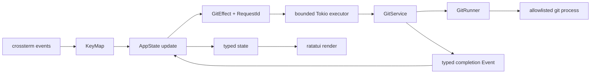

ChronoGitは、ドメイン、Gitアダプター、アプリケーション状態、ターミナル表示の各層に分かれた単一のRustバイナリです。この境界により、ドメイン規則へGitやターミナルI/Oが入り込まず、実ターミナルなしで状態遷移をテストできます。

簡潔なモジュール一覧はリポジトリの`DEVELOPMENT.md`にあります。このページは、各モジュールを変更するときに保つべき詳しい制約を記録します。

## モジュールの責務

### `src/domain`

リポジトリパス、object ID、変更、コミット、差分、ツリー項目を所有します。サブプロセスやターミナルへの依存はありません。

- `RepositoryRoot`、`RepoPath`、`ObjectId`、`RequestId`により、意味の異なる値の混同を防ぎます。
- `CommitBaseline`は空ツリーとfirst-parentの比較を明示します。
- `DiffTarget`はindex-to-worktreeパス、またはcommit/baseline/pathの組を識別します。
- `DiffDocument`はテキスト、バイナリ、空、切り詰め済みを排他的なvariantで表します。
- UnixではGitパスを内部でバイト列として保持し、非UTF-8名の表示時だけ代替表現を使います。

フィールドは非公開です。コンストラクターが、絶対パスのリポジトリルート、相対リポジトリパス、NULを含まないパス、16進数のobject IDを保証します。

### `src/git`

インストール済みGitとの通信をすべて所有します。

- `GitCommand`は閉じた許可リストで、呼び出し側は任意の引数を渡せません。
- `GitRunner`は唯一の差し替え用traitです。遅く状態を持つサブプロセスI/Oが実際のテスト境界であるためです。
- `SystemGitRunner`はシェルなしで実行し、上限付きのバイト出力を取得し、任意のロック、プロンプト、pager、色、外部diff、textconv、fsmonitor実行を無効にします。
- `GitService`は検出、status、履歴、メッセージ、変更ファイル、差分、ツリー子要素というドメイン操作を提供します。
- `git::parse`はNUL区切りの機械出力とunified patchを解析します。

リポジトリのobject formatをSHA-1と仮定しません。Gitが返した完全な16進object IDを保持します。

### `src/app`

対話状態と遷移を所有します。

- `AppView`、`FocusedPane`、`HistoryPanel`、`Overlay`が排他的なUI状態を表します。本文指向のHistoryレイアウトは独立したviewで、コミットメッセージ全文は引き続きoverlayです。
- `SearchState`は、検索対象のcollectionから独立してprompt編集、検索方向、順序付きの一致、折り返し選択を所有します。将来の一覧/ファイル検索も同じ動作を再利用できます。
- `LoadState<T>`はidle、request ID付きloading、ready、failedのいずれかです。
- `Action`はユーザーの意図、`Event`は非同期完了、`GitEffect`は唯一のGit副作用記述です。
- すべての要求に単調増加する`RequestId`を付けます。現在のリソースと選択コミットに一致する完了だけを適用します。
- 差分要求には75 msのdebounceがあり、Gitタスクは最大2つだけ同時実行します。
- 差分キャッシュは最大16項目、16 MiBです。更新時に消去します。
- 履歴は1ページ200コミットです。メッセージ、変更ファイル、差分、ツリーディレクトリは必要時に読み込みます。

ツリーディレクトリはobject IDで展開します。読み込んだ子要素は選択コミットについてキャッシュし、画面用の平坦化ツリーは完全なリポジトリパスと深さを保持します。

### `src/tui`

キー変換、ターミナルライフサイクル、レイアウト、描画、イベントループを所有します。

- `KeyMapper`がVim指向のキーイベントをactionへ変換します。`h`/`l`と`Ctrl-k`/`Ctrl-j`は同じ前/次ペインactionを使います。`zh`/`zl`は750 msで期限切れになります。
- `TerminalSession`がraw modeとalternate screenを有効化し、`Drop`でターミナル状態を復元します。
- panic hookも、以前のhookへ引き渡す前に同じ復元を行います。
- `tokio::select!`がターミナル入力、resize/tick、Ctrl-C、Git完了イベントを待ちます。
- 通常のHistoryはコミット、変更ファイル/ツリー、差分を全幅の3段で描画します。本文レイアウトは同じコミット一覧、コミット本文、変更ファイルを描画し、上段の選択変更時に残りの段を再読み込みします。Changesは110列以上で2ペインを表示し、それ未満ではフォーカス中のペインが横幅を使います。
- 80×24未満では安定したサイズ案内に置き換え、終了キーを使えるままにします。

## Git比較の契約

| 対象 | 比較 |
| --- | --- |
| 追跡済みワークツリーファイル | インデックス → ワークツリー |
| 未追跡ファイル | `/dev/null` → ワークツリーファイル |
| ルートコミット | 空ツリー → コミット |
| 通常コミット | 親 → コミット |
| マージコミット | first parent → マージコミット |

ワークツリー状態は`status --porcelain=v2 -z`から取得します。XYのワークツリー側で表示対象を決めるため、ステージ済みだけの項目は除外します。変更ファイルとツリーのparserはNUL区切り出力を扱います。object metadataは画面表示向けの列ではなく、固定フィールド数を使います。

## エラーと終了の方針

`AppError`と`GitError`は、`anyhow`や`thiserror`を使わずに`Display`、`Error`、原因チェーンを実装します。起動時エラーはターミナルに触れません。復旧可能な実行時エラーは`LoadState::Failed`または画面上のnoticeになります。

Git標準出力は8 MiB、標準エラーは64 KiB、コマンド時間は30秒に制限します。上限を超えると子プロセスを停止します。途中までのテキストパッチは`DiffDocument::Truncated`とし、機械可読な応答は途中まで解析せず失敗にします。

終了中に新しいeffectは送信しません。Tokio runtimeをdropすると実行中のblocking taskが完了し、TUIから戻る際にterminal guardが状態を復元します。

## セキュリティと互換性の不変条件

- `GitCommand`へGit変更コマンドを追加しないこと。
- リポジトリパスとpathspecは別々のプロセス引数にし、シェル文字列にしないこと。
- object IDをrevisionとして再利用する前に16進数として検証すること。
- リポジトリ設定からpager、diff、textconv、fsmonitorプログラムを起動させないこと。
- 全読み取り操作の前後で`HEAD`、porcelain status、ワークツリーのバイト列を比較するintegration testを維持すること。
- LinuxとmacOSが`0.1.0`のサポート境界です。Windows対応では未検証変換を加えず、Unixバイトパス境界を再設計すること。
- bareリポジトリと非対話ターミナルは起動時に拒否すること。

将来の機能は、この境界を迂回せずdomain variantと型付きcommand/effect経路を追加してください。

## 変更する場所

| 変更 | 主な場所 | 併せて確認するもの |
| --- | --- | --- |
| ドメイン不変条件、値型 | `src/domain` | parser、app state、integration fixture |
| Git操作 | `src/git/command.rs`、`runner.rs`、`service.rs` | 読み取り専用方針、出力上限、parser test |
| 非同期読み込み、選択 | `src/app/model.rs`、`update.rs`、`effect.rs` | request ID、古い応答、cache上限 |
| キー、操作 | `src/tui/keymap.rs` | reducer動作、help/footer、ドキュメント |
| レイアウト、ターミナルライフサイクル | `src/tui/render`、`terminal.rs`、`tui/mod.rs` | 最小サイズ、PTY smoke、復元 |

不変条件を変える前に実装と最も近いテストを読んでください。必要な検証層は[検証ガイド](/ja/developer/validation/)で説明します。
