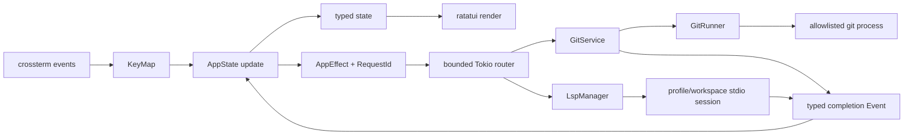

ChronoGitは、ドメイン、Gitアダプター、アプリケーション状態、ターミナル表示の各層に分かれた単一のRustバイナリです。この境界により、ドメイン規則へGitやターミナルI/Oが入り込まず、実ターミナルなしで状態遷移をテストできます。

簡潔なモジュール一覧はリポジトリの`DEVELOPMENT.md`にあります。このページは、各モジュールを変更するときに保つべき詳しい制約を記録します。

各レイヤーはRustの非`mod.rs`レイアウトを使います。`src/<module>.rs`が
境界の説明と宣言を所有し、`src/<module>/*.rs`が凝集した個別概念を所有します。
モジュールの追加や分割でもこの配置を維持してください。

## モジュールの責務

### `src/domain.rs`と`src/domain/`

リポジトリパス、object ID、変更、コミット、差分、ツリー項目、検索一致、上限付きの現在ファイル文書を所有します。サブプロセスやターミナルへの依存はありません。

- `RepositoryRoot`、`RepoPath`、`ObjectId`、`RequestId`により、意味の異なる値の混同を防ぎます。
- `CommitBaseline`は空ツリーとfirst-parentの比較を明示します。
- `DiffTarget`はindex-to-worktreeパス、またはcommit/baseline/pathの組を識別します。
- `DiffDocument`はテキスト、バイナリ、空、切り詰め済みを排他的なvariantで表します。
- UnixではGitパスを内部でバイト列として保持し、非UTF-8名の表示時だけ代替表現を使います。

フィールドは非公開です。コンストラクターが、絶対パスのリポジトリルート、相対リポジトリパス、NULを含まないパス、16進数のobject IDを保証します。

### `src/git.rs`と`src/git/`

インストール済みGitとの通信をすべて所有します。

- `GitCommand`は閉じた許可リストで、呼び出し側は任意の引数を渡せません。
- `GitRunner`は唯一の差し替え用traitです。遅く状態を持つサブプロセスI/Oが実際のテスト境界であるためです。
- `SystemGitRunner`はシェルなしで実行し、上限付きのバイト出力を取得し、任意のロック、プロンプト、pager、色、外部diff、textconv、fsmonitor実行を無効にします。
- `GitService`は検出、status、履歴、メッセージ、変更ファイル、差分、ツリー子要素、追跡済み/非ignoreパス一覧、ファイル/内容検索、ファイル単位履歴、上限付き現在内容というドメイン操作を提供します。現在ファイルは検出済みワークツリーのdescriptorから相対的に開き、すべてのパス要素でシンボリックリンクを拒否します。
- `git::parse`はNUL区切りの機械出力とunified patchを解析します。

リポジトリのobject formatをSHA-1と仮定しません。Gitが返した完全な16進object IDを保持します。

### `src/app.rs`と`src/app/`

対話状態と遷移を所有します。

`app::vim`は文書の行を借用し、countに対応したcursorとviewportの移動を適用します。検索反復は現在のcursorを起点に、アクティブ文書の一致を再計算し、countを一致位置のindexで折り返します。Codeのmarkと検索は上限付きLSP jump履歴を共有し、count付き移動では最終到達先だけを読み込みます。

- `AppView`、`FocusedPane`、`HistoryPanel`、`Overlay`が排他的なUI状態を表します。Changes、History/本文、Graph/詳細、ファイル履歴、Codeはview、リポジトリ検索、メッセージ全文、差分全文、現在ファイル内容、Code全文はoverlayです。
- `SearchState`はCode、差分、ファイル、コミットメッセージのアクティブ文書内のsmart-case位置検索を所有します。`RepositorySearchState`はグローバルprompt、live query、結果、選択、戻り先viewを別に所有します。有効なpromptがSearchフォーカスを表し、Resultsへ移ってもクエリを保持するため、Searchへ戻して再編集できます。クエリ編集ごとに新しい型付きeffectを発行し、古い完了が新しい結果を置き換えないようRequestIdで防ぎます。`FileViewState`は検索結果の選択パス、履歴/現在内容、下段が内容か履歴差分かを所有します。`CodeViewState`は完全なパス集合、画面用ツリー、選択パス、上限付き内容、コード表示位置を所有します。
- `SearchState`は元のUTF-8一致開始・終了位置と独立した強調表示状態を保持します。Diff・Code描画はサニタイズ後の範囲へ変換し、syntax spanに装飾を重ね、その後にカーソル装飾とviewportの切り出しを適用します。強調解除は検索・移動状態を保ち、一致への移動で再表示します。`DismissSearchOrClose`は標準Escだけが発行し、入力キャンセルと最前面の別画面を優先します。明示的な`close`設定は標準の両キーを即時close操作へ置き換えます.
- `LoadState<T>`はidle、request ID付きloading、ready、failedのいずれかです。
- `Action`はユーザーの意図、`Event`は非同期完了、`GitEffect`は閉じたGit副作用記述です。`AppEffect`が既存`GitEffect`と常駐型`LspEffect`を、それぞれのlifecycleを混ぜずにroutingします。`SemanticNavigationState`は候補、request identity、上限付き双方向jump historyを所有し、`LspHoverState`はhover request、戻り先overlay、scroll offsetを所有します。
- すべての要求に単調増加する`RequestId`を付けます。現在のリソースと選択コミットに一致する完了だけを適用します。
- 差分要求には75 ms、live repository searchには100 msのdebounceがあり、Gitタスクは最大2つだけ同時実行します。
- 差分キャッシュは最大16項目、16 MiBです。更新時に消去します。
- 履歴は1ページ200コミット、ファイル履歴は最大200コミットです。メッセージ、変更ファイル、差分、現在内容、検索、ツリーディレクトリは必要時に読み込みます。

ツリーディレクトリはobject IDで展開します。読み込んだ子要素は選択コミットについてキャッシュし、画面用の平坦化ツリーは完全なリポジトリパスと深さを保持します。

Codeツリーは別の方法を使います。Gitから追跡済み・非ignoreのワークツリーパスを一度取得し、`app::code_view`が展開されたdirectoryの直下だけを平坦な表示一覧へ投影します。directoryの展開/折り畳みでは追加のfilesystem走査やsubprocessを使いません。ファイル内容は引き続きdescriptor相対・link非追従のservice経路で読みます。

### `src/tui.rs`と`src/tui/`

キー変換、ターミナルライフサイクル、レイアウト、描画、イベントループを所有します。

- `KeyMapper`が組み込みまたはXDG/`--keymap`設定を使い、Vim normal-modeキーをcount・文字引数付きactionへ変換します。find/tillとmarkの文字引数、文字検索の方向を保持し、曖昧なprefixを拒否し、通常の連続キーは750 msで期限切れになります。Ctrl-Cは安全な終了用に予約します。
- `TerminalSession`がraw modeとalternate screenを有効化し、`Drop`でターミナル状態を復元します。
- panic hookも、以前のhookへ引き渡す前に同じ復元を行います。
- `tokio::select!`がターミナル入力、resize/tick、Ctrl-C、型付き非同期完了イベントを待ちます。通常終了ではterminalを復元してから上限付きLSP shutdownを待ちます。
- 通常のHistoryはコミット、変更ファイル/ツリー、差分を全幅の3段で描画し、本文レイアウトは同じコミット一覧、コミット本文、変更ファイルを描画します。Graphは読み込んだ親IDからクライアント側でレーンを描き、その上の中央ウィンドウへ詳細2段を描画します。ファイル履歴とCodeは2段のビューです。Changesは110列以上で2ペインを表示し、それ未満ではフォーカス中のペインが横幅を使います。
- 80×24未満では安定したサイズ案内に置き換え、終了キーを使えるままにします。

## Git比較の契約

| 対象 | 比較 |
| --- | --- |
| 追跡済みワークツリーファイル | インデックス → ワークツリー |
| 未追跡ファイル | `/dev/null` → ワークツリーファイル |
| ルートコミット | 空ツリー → コミット |
| 通常コミット | 親 → コミット |
| マージコミット | first parent → マージコミット |

ワークツリー状態は`status --porcelain=v2 -z`から取得します。XYのワークツリー側で表示対象を決めるため、ステージ済みだけの項目は除外します。変更ファイルとツリーのparserはNUL区切り出力を扱います。object metadataは画面表示向けの列ではなく、固定フィールド数を使います。

## エラーと終了の方針

`AppError`、`GitError`、`KeyMapError`は、`anyhow`や`thiserror`を使わずに`Display`、`Error`、原因チェーンを実装します。起動時エラーはターミナルに触れません。復旧可能な実行時エラーは`LoadState::Failed`または画面上のnoticeになります。

Git標準出力は8 MiB、標準エラーは64 KiB、コマンド時間は30秒に制限します。上限を超えると子プロセスを停止します。途中までのテキストパッチは`DiffDocument::Truncated`とし、機械可読な応答は途中まで解析せず失敗にします。

終了中に新しいeffectは送信しません。Tokio runtimeをdropすると実行中のblocking taskが完了し、TUIから戻る際にterminal guardが状態を復元します。

## セキュリティと互換性の不変条件

- `GitCommand`へGit変更コマンドを追加しないこと。
- リポジトリパスとpathspecは別々のプロセス引数にし、シェル文字列にしないこと。
- object IDをrevisionとして再利用する前に16進数として検証すること。
- リポジトリ設定からpager、diff、textconv、fsmonitorプログラムを起動させないこと。
- 現在ファイルはdescriptorから相対的に読み、すべてのパス要素でシンボリックリンクを拒否すること。
- 全読み取り操作の前後で`HEAD`、porcelain status、ワークツリーのバイト列を比較するintegration testを維持すること。
- LinuxとmacOSが`0.4.0`のサポート境界です。Windows対応では未検証変換を加えず、Unixバイトパス境界を再設計すること。
- bareリポジトリと非対話ターミナルは起動時に拒否すること。

将来の機能は、この境界を迂回せずdomain variantと型付きcommand/effect経路を追加してください。

## 言語セマンティックナビゲーション

`src/lsp.rs`と`src/lsp/`は共通のLSP 3.17 client境界です。`config`はtrusted user profileとextension/root-marker routing、`protocol`は上限付き`Content-Length` JSON-RPC framing、`position`はChronoGitのUTF-8 byte列から合意済みUTF-8/16/32 code unitへの変換、`session`はinitialize、document同期、navigation/hover request、cancel、server request、shutdown、child cleanup、`manager`はprofile/workspace sessionとLRU終了を所有します。

LSPは新しいcrateではなく、既存`chronogit` crate内のmoduleに意図的に収めています。process lifecycleをapplicationの起動・終了と共有し、現在のconsumerはapp effect executorだけで、Tokio/serde/url dependencyも同じbinary内で使うためです。別crateは独立reuseやdependency隔離を生まないままmanifest、release/API surface、変換層だけを増やします。実際に別binary/libraryから利用する、またはCargo levelのdependency隔離が必要になった時点でextractを再検討します。

appはRust、Java、Pythonで分岐しません。extensionは明示的に有効な1つの`ServerProfile`へ解決し、最も近いroot markerでworkspaceを決め、`(profile ID, workspace root)`をsession keyにします。rust-analyzer、JDT LS、Pyright、basedpyright、pylspも通常のprofile dataです。user-level TOMLで別languageを追加してもtransport実装は増えません。同じextensionを複数profileが担当する場合は暗黙順序を付けずrequest時に拒否します。

各sessionはcapabilityとposition encodingを合意し、正確なopen documentを1つ保持し、refresh後はfull-content `didChange`、切替時は前documentの`didClose`を送ります。navigationと`textDocument/hover`は同じ同期済みposition request経路を使い、標準hover content形式をappへ渡す前に上限付き表示textへ正規化します。reader/writer taskを分離してnotificationやserver-to-client requestがresponseをdeadlockさせないようにします。標準log/progress notificationは1つのbounded footer statusへ変換します。`workspace/configuration`とwork-progress作成だけを応答し、advertiseしていないrequestはmethod-not-foundです。新しいLSP intentは`$/cancelRequest`を送り、reducerもrequest ID/path/cursorが古いcompletionを拒否します。

wireの`Location`/`LocationLink`はadapter内で正規化します。repository内`file:`結果を`RepoPath`へ変換した後、`GitService`で安全に読んだ内容を使ってwire columnを変換するため、no-follow境界を維持します。非file、`jdt:`、不正、repository外URIは表示専用です。sessionは最大4、同期documentはsessionごとに最大8 MiBです。5つ目ではLRU sessionを終了します。通常終了は`shutdown`、応答待ち、`exit`の後、猶予を超えたchildを終了し、`kill_on_drop`を最終cleanup不変条件にします。

## 変更する場所

| 変更 | 主な場所 | 併せて確認するもの |
| --- | --- | --- |
| ドメイン不変条件、値型 | `src/domain` | parser、app state、integration fixture |
| Git操作 | `src/git/command.rs`、`runner.rs`、`service.rs` | 読み取り専用方針、出力上限、parser test |
| LSP profile/protocol/session | `src/lsp/config.rs`、`protocol.rs`、`session.rs`、`manager.rs` | trust boundary、framing上限、capability/position test、cleanup |
| 非同期読み込み、選択 | `src/app/model.rs`、`update.rs`、`effect.rs` | request ID、古い応答、cache上限 |
| キー、操作 | `src/tui/keymap.rs`、`keymap/config.rs` | 設定例、reducer動作、help/footer、ドキュメント |
| レイアウト、ターミナルライフサイクル | `src/tui/render.rs`、`tui/terminal.rs`、`src/tui.rs` | 最小サイズ、PTY smoke、復元 |

不変条件を変える前に実装と最も近いテストを読んでください。contribution checkは`CONTRIBUTING.md`、release固有のcheckは[リリース手順](/ja/developer/release/)に置きます。
