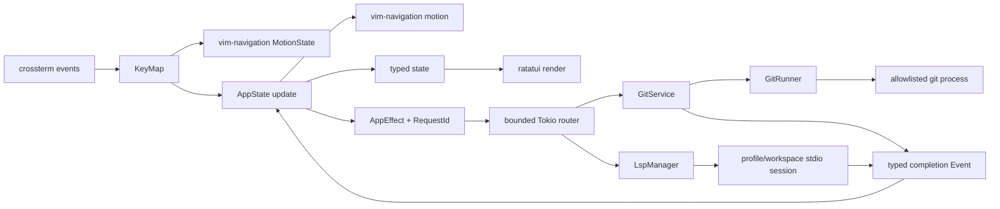

ChronoGitはCargo workspaceです。既存の`chronogit` library/binaryをdomain、Git adapter、application state、terminal表示の各層に分け、兄弟の`vim-navigation` libraryを再利用可能なtext navigation境界にしています。この境界により、domain規則へGitやterminal I/Oが入り込まず、実terminalなしで状態遷移をtestできます。

```mermaid
flowchart LR
    accTitle: ChronoGitの要求と描画の流れ
    accDescr: ターミナル入力がアプリケーション状態を更新し、上限付きの読み取り要求がGitまたはLSPサービスから返り、その状態をターミナルへ描画します。
    Terminal["crossterm events"] --> KeyMap
    KeyMap --> VimState["vim-navigation MotionState"]
    KeyMap --> Update["AppState update"]
    Update --> VimMotion["vim-navigation motion"]
    Update --> State["typed state"]
    Update --> Effect["AppEffect + RequestId"]
    Effect --> Executor["bounded Tokio router"]
    Executor --> Service["GitService"]
    Executor --> Manager["LspManager"]
    Manager --> LSP["profile/workspace stdio session"]
    LSP --> Event
    Service --> Runner["GitRunner"]
    Runner --> Git["allowlisted git process"]
    Service --> Event["typed completion Event"]
    Event --> Update
    State --> Render["ratatui render"]
```

簡潔なモジュール一覧はリポジトリの`DEVELOPMENT.md`にあります。このページは、各モジュールを変更するときに保つべき詳しい制約を記録します。

各レイヤーはRustの非`mod.rs`レイアウトを使います。`src/<module>.rs`が
境界の説明と宣言を所有し、`src/<module>/*.rs`が凝集した個別概念を所有します。
モジュールの追加や分割でもこの配置を維持してください。

## モジュールの責務

### `crates/vim-navigation`

frameworkに依存しない`Cursor`、`Viewport`、`Motion`、`CountSource`、`MotionState`と、
Normal / Insertを分離した明示的にmutableな`EditableBuffer`を所有します。
dependencyは`unicode-width`だけで、Git、LSP、crossterm、ratatui、process、
filesystem、networkの境界を持ちません。Vim 9.1.1244との全比較条件、command
inventory、実行可能oracle、motion外の境界はcrateの`COMPATIBILITY.md`を正とします。

public moduleの境界はkey syntaxではなくstateの所有者で分けます。

- `command.rs`は飽和するcount、型付きの明示/暗黙count由来、未完了のfind/till文字引数、`;`/`,`の反復状態を
  所有します。
- `motion.rs`はread-onlyな座標・motion語彙を所有し、privateな
  `motion/buffer.rs`の意味的scan、`motion/engine.rs`のdispatch/viewport規則、
  `motion/line.rs`のUTF-8/display-cell計算をfacadeとしてまとめます。
- `editor.rs`はopt-inのmutable text、mode、cursor不変条件、byte上限、入力結果と
  設定可能なInsert escape sequenceを所有します。標準`jj` resolverは候補prefixを
  即時挿入し認識状態だけを保持するため、flush・focus・設定変更の境界でも入力文字を
  失いません。

crate rootはpublicな型と関数をre-exportするため、この内部分割でdownstreamの
import pathを変える必要はありません。`command`と`editor`のunit testは実装の
近くに保ち、大きなmotion契約は`motion/tests.rs`、外部Vim oracleは
`tests/vim_oracle.rs`に置きます。

`apply`へ渡した借用textは変更しません。編集は`EditableBuffer`だけの明示的な
opt-inで、ChronoGitはこれを生成しません。この分離により、source、diff、Git
object、検索prompt、commit messageを編集可能にせず、`i`/`a`/`I`/`A`/`o`/`O`、
文字入力、修正、改行、Esc、標準または設定可能なInsert escape sequenceを再利用契約
としてtestできます。

### `src/domain.rs`と`src/domain/`

リポジトリパス、object ID、変更、コミット、差分、ツリー項目、検索一致、document symbol、上限付きの現在またはrevisionファイル文書を所有します。サブプロセスやターミナルへの依存はありません。

- `RepositoryRoot`、`RepoPath`、`ObjectId`により、filesystem path、Git path、revisionの混同を防ぎます。標準の`AsRef`、`TryFrom`、`FromStr`も名前付きconstructorと同じ検証を維持します。
- `CommitPage`は履歴offsetと0ではないpage sizeをまとめ、`LineNumber`はdiffと検索位置を1始まりかつ0以外に保ちます。
- `CommitBaseline`は空ツリーとfirst-parentの比較を明示します。
- `DiffTarget`はindex-to-worktreeパス、またはcommit/baseline/pathの組を識別します。
- `FileRevision`はdiff比較へ意味を重ねず、working treeまたはcommitのsourceを識別します。
- `DiffDocument`はテキスト、バイナリ、空、切り詰め済みを排他的なvariantで表します。
- `TextFileDocument`は正確なUTF-8、表示専用、切り詰め済みを排他的にし、`GitTreeMode`はGit object-type/modeの組、`DocumentSymbolKind`はLSPの数値語彙を検証・正規化します。
- UnixではGitパスを内部でバイト列として保持し、非UTF-8名の表示時だけ代替表現を使います。

フィールドは非公開です。コンストラクターが、絶対パスのリポジトリルート、相対リポジトリパス、NULを含まないパス、16進数のobject IDを保証します。

### `src/git.rs`と`src/git/`

インストール済みGitとの通信をすべて所有します。

- `GitCommand`は閉じた許可リストで、呼び出し側は任意の引数を渡せません。
- `GitRunner`は唯一の差し替え用traitです。遅く状態を持つサブプロセスI/Oが実際のテスト境界であるためです。外部実装はプロセス終了状態と、各バイト列の`CommandStream::Complete`または`CommandStream::Truncated`から`CommandOutput`を生成します。
- `SystemGitRunner`はシェルなしで実行し、上限付きのバイト出力を取得し、command statusとstream completenessを別々の内部状態として保持し、任意のロック、プロンプト、pager、色、外部diff、textconv、fsmonitor実行を無効にします。
- `GitService`は検出、status、履歴、メッセージ、変更ファイル、差分、ツリー子要素、追跡済み/非ignoreパス一覧、ファイル/内容検索、ファイル単位履歴、上限付きの現在またはrevision内容というドメイン操作を提供します。現在ファイルは検出済みワークツリーのdescriptorから相対的に開き、すべてのパス要素でシンボリックリンクを拒否します。revisionファイルはcommitをcheckoutせず、検証済みobject/pathのGit readで取得します。
- `git::parse`はNUL区切りの機械出力とunified patchを解析します。patch parserはmetadataと、old/new側の残り行数を持つ検証済みhunkを区別し、headerに似たsource行にも正しい位置を付けます。切り詰めたpatchでは完全な行だけを保持します。discoveryはGitが付加したLFを1つだけ除き、リポジトリ名に含まれるCR/LFを保持します。

リポジトリのobject formatをSHA-1と仮定しません。Gitが返した完全な16進object IDを保持します。

### `src/app.rs`と`src/app/`

対話状態と遷移を所有します。

`app::vim`はworkspaceの`vim-navigation` crateに対する座標adapterです。`SourcePosition`とpane geometryを変換し、借用した文書行へcrateのcount対応cursor/viewport motionを適用します。検索反復は現在のcursorを起点に、active文書の一致を再計算し、countを一致位置のindexで折り返します。Codeのmarkと検索は上限付きLSP jump履歴を共有し、count付き移動では最終到達先だけを読み込みます。検索query・highlightとresource-awareなmark/jumpはChronoGitの文書・pathを参照するためapplication stateに残します。

- `AppView`、`FocusedPane`、`HistoryPanel`、`Overlay`が排他的なUI状態を表します。Changes、History/本文、Graph/詳細、ファイル履歴、Codeはview、リポジトリ検索、メッセージ全文、差分全文、source内容、source全文、symbol contextはoverlayです。
- `SearchState`はCode、差分、ファイル、コミットメッセージのアクティブ文書内のsmart-case位置検索を所有します。検索範囲、大小文字、開始位置の包含は位置引数の`bool`ではなく別々の値です。`RepositorySearchState`はグローバルprompt、live query、結果、選択、戻り先viewを別に所有します。有効なpromptがSearchフォーカスを表し、Resultsへ移ってもクエリを保持するため、Searchへ戻して再編集できます。クエリ編集ごとに新しい型付きeffectを発行し、古い完了が新しい結果を置き換えないようRequestIdで防ぎます。`FileViewState`は検索結果の選択パス、履歴/現在内容、排他的な現在内容/履歴差分modeを所有します。`CodeViewState`は完全なパス集合、画面用ツリー、選択パス、上限付き内容、コード表示位置を所有します。
- `SearchState`は元のUTF-8一致開始・終了位置と独立した強調表示状態を保持します。Diff・Code・全文表示の描画はサニタイズ後の範囲へ変換し、syntax spanに装飾を重ね、その後にカーソル装飾とviewportの切り出しを適用します。強調解除は検索・移動状態を保ち、一致への移動で再表示します。`DismissSearchOrClose`は標準Escだけが発行し、入力キャンセルと最前面の別画面を優先します。明示的な`close`設定は標準の両キーを即時close操作へ置き換えます。
- 文書内検索の削除は`SearchState`が所有します。Backspaceは1文字を削除し、既に空ならpromptだけをキャンセルします。reducerは同じ操作で通常移動やcloseを重ねず、確定検索と閲覧位置を保ちます。リポジトリ検索の削除は独立したlive queryの経路を維持します。
- `LoadState<T>`はidle、request ID付きloading、ready、failedのいずれかです。Changes、commit history、その他のview間を移動すると共有diffをリセットして再選択し、非表示の一覧への応答で表示中のdiffを置き換えません。全体の終了処理はmodalへのdispatchより先に扱います。
- `Action`はユーザーの意図、`Event`は非同期完了、`GitEffect`は閉じたGit副作用記述です。`AppEffect`が既存`GitEffect`と常駐型`LspEffect`を、それぞれのlifecycleを混ぜずにroutingします。`SemanticNavigationState`は候補、request identity、上限付き双方向jump historyを所有し、`LspHoverState`はhover request、戻り先overlay、scroll offsetを所有します。
- `app::source_view`はdiff cursorをnew側source行へ投影し、worktreeまたは選択commitを読み、変更されたnew側行を保持して、全文とdocument-symbol overlayを調停します。symbol選択は、その正確な読み込み済みdocument内のlocal navigationです。worktree diffからsourceを開き直すと新しいsnapshotを読み、commit sourceは不変のidentityで再利用できます。表示済みsourceのoverlay内で移動する場合は、そのdocumentのsnapshotを維持します。
- すべての要求に単調増加する`RequestId`を付け、source snapshotには別の`DocumentRevision`を使います。現在のリソースと選択コミットまたはdocument generationに一致する完了だけを適用します。LSP operation、JSON-RPC request、document versionのcounterはprotocol adapter内で別型のまま保持します。
- 差分要求には75 ms、live repository searchには100 msのdebounceがあり、Gitタスクは最大2つだけ同時実行します。
- 差分キャッシュは最大16項目、16 MiBです。更新時に消去します。
- 履歴は1ページ200コミット、ファイル履歴は最大200コミットです。メッセージ、変更ファイル、差分、現在内容、検索、ツリーディレクトリは必要時に読み込みます。

ツリーディレクトリはobject IDで展開します。読み込んだ子要素は選択コミットについてキャッシュし、画面用の平坦化ツリーは完全なリポジトリパスと深さを保持します。

Codeツリーは別の方法を使います。Gitから追跡済み・非ignoreのワークツリーパスを一度取得し、`app::code_view`が展開されたdirectoryの直下だけを平坦な表示一覧へ投影します。directoryの展開/折り畳みでは追加のfilesystem走査やsubprocessを使いません。ファイル内容は引き続きdescriptor相対・link非追従のservice経路で読みます。

### `src/tui.rs`と`src/tui/`

キー変換、ターミナルライフサイクル、レイアウト、描画、イベントループを所有します。

- `KeyMapper`が組み込みまたはXDG/`--keymap`設定を使い、Vim normal-modeキーをactionへ変換します。`KeyInputContext`は位置`bool`を使わず通常commandと検索入力を区別します。再利用crateの`MotionState`が10進count、find/tillの文字引数、`;`/`,`の方向を所有し、adapterはterminal sequenceとresource-awareなmark引数を所有します。ChronoGitはSpaceをapplication leaderに予約するため、crateの単独Space/`RightWrap` motionを標準normal-context bindingから外します。`l`/Rightは維持し、custom mapでは`cursor_right_wrap`を競合しないキーへ配置できます。検索入力ではnormal bindingより先に印字可能なSpaceと`jj`をquery文字として解決します。曖昧なprefixを拒否し、通常の連続キーは750 msで期限切れになります。Ctrl-Cは安全な終了用に予約します。
- `BindingCommand`は完了したactionと文字引数待ちのmark commandを区別し、`Action`内の番兵文字を不要にします。
- `TerminalSession`がraw modeとalternate screenを有効化し、`Drop`でターミナル状態を復元します。
- panic hookも、以前のhookへ引き渡す前に同じ復元を行います。
- `tokio::select!`がターミナル入力、resize/tick、Ctrl-C、型付き非同期完了イベントを待ちます。通常終了ではterminalを復元してから上限付きLSP shutdownを待ちます。
- 通常のHistoryはコミット、変更ファイル/ツリー、差分を全幅の3段で描画し、本文レイアウトは同じコミット一覧、コミット本文、変更ファイルを描画します。Graphは読み込んだ親IDからクライアント側でレーンを描き、その上の中央ウィンドウへ詳細2段を描画します。ファイル履歴とCodeは2段のビューです。Changesは110列以上で2ペインを表示し、それ未満ではフォーカス中のペインが横幅を使います。
- 80×24未満では安定したサイズ案内に置き換え、終了キーを使えるままにします。

pane比率、overlay inset、border、gutter、responsive thresholdは`src/layout.rs`で共有します。描画とreducer側のviewport計算が同じ定数を使うため、cursor followの計算と表示layoutが暗黙にずれません。

## Git比較の契約

| 対象 | 比較 |
| --- | --- |
| 追跡済みワークツリーファイル | インデックス → ワークツリー |
| 未追跡ファイル | `/dev/null` → ワークツリーファイル |
| ルートコミット | 空ツリー → コミット |
| 通常コミット | 親 → コミット |
| マージコミット | first parent → マージコミット |

ワークツリー状態は`status --porcelain=v2 -z`から取得します。XYのワークツリー側で表示対象を決めるため、ステージ済みだけの項目は除外します。変更ファイルとツリーのparserはNUL区切り出力を扱います。object metadataは画面表示向けの列ではなく、固定フィールド数を使います。

## エラーと終了の方針

`AppError`、`GitError`、`KeyMapError`は、`anyhow`や`thiserror`を使わずに`Display`、`Error`、原因チェーンを実装します。起動時エラーはターミナルに触れません。復旧可能な実行時エラーは`LoadState::Failed`または画面上のnoticeになります。

Git標準出力は8 MiB、標準エラーは64 KiB、コマンド時間は30秒に制限します。上限を超えると子プロセスを停止します。途中までのテキストパッチは`DiffDocument::Truncated`とし、機械可読な応答は途中まで解析せず失敗にします。

終了中に新しいeffectは送信しません。Tokio runtimeをdropすると実行中のblocking taskが完了し、TUIから戻る際にterminal guardが状態を復元します。

## セキュリティと互換性の不変条件

- `GitCommand`へGit変更コマンドを追加しないこと。
- リポジトリパスとpathspecは別々のプロセス引数にし、シェル文字列にしないこと。
- object IDをrevisionとして再利用する前に16進数として検証すること。
- リポジトリ設定からpager、diff、textconv、fsmonitorプログラムを起動させないこと。
- 現在ファイルはdescriptorから相対的に読み、すべてのパス要素でシンボリックリンクを拒否すること。revision readは型付き・検証済み・shell-free・上限付きに保つこと。
- 全読み取り操作の前後で`HEAD`、porcelain status、ワークツリーのバイト列を比較するintegration testを維持すること。
- ChronoGitの文書入力をread-onlyに保つこと。`vim_navigation::EditableBuffer`へ流さず、repository/document search promptの既存の確定、Backspace、Esc契約を維持すること。
- LinuxとmacOSが`0.6.0`のサポート境界です。Windows対応では未検証変換を加えず、Unixバイトパス境界を再設計すること。
- bareリポジトリと非対話ターミナルは起動時に拒否すること。

将来の機能は、この境界を迂回せずdomain variantと型付きcommand/effect経路を追加してください。

## 言語セマンティックナビゲーション

`src/lsp.rs`と`src/lsp/`は共通のLSP 3.17 client境界です。`config`はtrusted user profileとextension/root-marker routing、`protocol`は上限付き`Content-Length` JSON-RPC framing、`position`はChronoGitのUTF-8 byte列から合意済みUTF-8/16/32 code unitへの変換、`session`はinitialize、document同期、navigation/hover/document-symbol request、cancel、server request、shutdown、child cleanup、`manager`はprofile/workspace sessionとLRU終了を所有します。

LSPは新しいcrateではなく、既存`chronogit` crate内のmoduleに意図的に収めています。process lifecycleをapplicationの起動・終了と共有し、現在のconsumerはapp effect executorだけで、Tokio/serde/url dependencyも同じbinary内で使うためです。別crateは独立reuseやdependency隔離を生まないままmanifest、release/API surface、変換層だけを増やします。実際に別binary/libraryから利用する、またはCargo levelのdependency隔離が必要になった時点でextractを再検討します。

appはRust、Java、Pythonで分岐しません。extensionは明示的に有効な1つの`ServerProfile`へ解決し、最も近いroot markerでworkspaceを決め、`(profile ID, workspace root)`をsession keyにします。rust-analyzer、JDT LS、Pyright、basedpyright、pylspも通常のprofile dataです。user-level TOMLで別languageを追加してもtransport実装は増えません。同じextensionを複数profileが担当する場合は暗黙順序を付けずrequest時に拒否します。

各sessionはcapabilityとposition encodingを合意し、正確なopen documentを1つ保持し、refresh後はfull-content `didChange`、切替時は前documentの`didClose`を送ります。navigationと`textDocument/hover`は同期済みposition request経路を使い、`textDocument/documentSymbol`はcursor位置を伴わず同じdocument同期を使います。標準hover contentと階層型/flat型document symbolを、appへ渡す前に上限付きdomain値へ正規化します。受信と送信は独立したreader/writer taskで扱います。標準log/progress notificationは1つのbounded footer statusへ変換します。`workspace/configuration`とwork-progress作成だけを応答し、advertiseしていないrequestはmethod-not-foundです。新しいLSP intentはblockingせずに`$/cancelRequest`の送信を試み、reducerもrequest ID/path/cursorが古いcompletionを拒否します。

wireの`Location`/`LocationLink`はadapter内で正規化します。repository内`file:`結果を`RepoPath`へ変換した後、`GitService`で安全に読んだ内容を使ってwire columnを変換するため、no-follow境界を維持します。非file、`jdt:`、不正、repository外URIは表示専用です。sessionは最大4、同期documentはsessionごとに最大8 MiBです。5つ目ではLRU sessionを終了します。通常終了は`shutdown`、応答待ち、`exit`の後、猶予を超えたchildを終了し、`kill_on_drop`を最終cleanup不変条件にします。

headerの読み取りは改行を待ち続ける前にバイト上限を適用します。requestの期限はwriter queueへの投入待ちと応答待ちの両方を含み、notificationとshutdownの送信にも上限を設けます。cancelはbest effortで、満杯のqueueに阻まれません。`TransportTasks`は初期化失敗を含むconnectionのdrop時にreader、writer、stderr taskをabortします。

## 変更する場所

| 変更 | 主な場所 | 併せて確認するもの |
| --- | --- | --- |
| 汎用Vim motion、Normal / Insert契約 | `crates/vim-navigation` | `COMPATIBILITY.md`、oracle/unit test、ChronoGit adapter |
| ドメイン不変条件、値型 | `src/domain` | parser、app state、integration fixture |
| Git操作 | `src/git/command.rs`、`runner.rs`、`service.rs` | 読み取り専用方針、出力上限、parser test |
| LSP profile/protocol/session | `src/lsp/config.rs`、`protocol.rs`、`session.rs`、`manager.rs` | trust boundary、framing上限、capability/position test、cleanup |
| 非同期読み込み、選択 | `src/app/model.rs`、`update.rs`、`effect.rs` | request ID、古い応答、cache上限 |
| キー、操作 | `src/tui/keymap.rs`、`keymap/config.rs` | 設定例、reducer動作、help/footer、ドキュメント |
| レイアウト、ターミナルライフサイクル | `src/tui/render.rs`、`tui/terminal.rs`、`src/tui.rs` | 最小サイズ、PTY smoke、復元 |

不変条件を変える前に実装と最も近いテストを読んでください。contribution checkは`CONTRIBUTING.md`、release固有のcheckは[リリース手順](/ja/developer/release/)に置きます。
